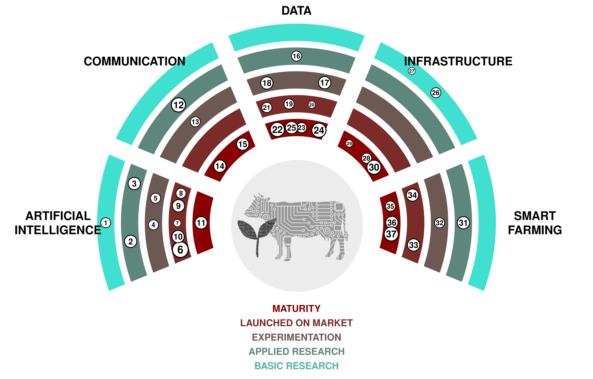

(1) **Superintelligence:** A hypothetical agent or system that possesses intelligence far surpassing that of the brightest and most gifted human beings in virtually all domains of interest. 

(2) **AGI:** Short for Artificial General Intelligence. A hypothetical type of intelligent agent that can learn to accomplish any intellectual task that human beings can perform. 

(3) **Real time speech translation:** Tools that allow to instantly translate speech from one language to another.  [SpeechTrans 🡥](https://speechtrans.com/)

(4) **AutoML:** Short for Automated Machine Learning, refers to the process of automating the tasks of selecting and fine-tuning machine learning models to real-world problems. Allows for cheap model fitting wherever small data sets are available. [R package automl 🡥](https://cran.r-project.org/web/packages/automl/)

(5) **Text-to-speech:** Software that generates speech from written text which sounds like (interesting) human beings.  [OpenAI’s TTS 🡥](https://platform.openai.com/docs/guides/text-to-speech)

(6) **Large Language Models:** Systems that are capable of generating written text in a human-like manner.  [ChatGPT 🡥](https://chat.openai.com/)

(7) **Facial Recognition:** Software that can measure the similarity of faces from images or video, thus recognizing faces.  [PimEyes 🡥](https://pimeyes.com/)

(8) **Latent Diffusion Models:** Models that generate arbitrary images from text, image or parameter inputs.  [Midjourney 🡥](https://www.midjourney.com/)

(9) **Speech-to-text:** Machine learning models that convert speech of various languages to text.  [Whisper 🡥](https://openai.com/research/whisper)

(10) **Large Multimodal Models:** Advanced artificial intelligence systems that can process information from multiple types of data, such as text, images, audio, and video, using powerful pre-trained language models as a core component.  [GPT-4 🡥](https://openai.com/blog/chatgpt-can-now-see-hear-and-speak)

(11) **Machine Translation:** Software that automatically translates text from one language to another.  [Deepl 🡥](https://deepl.com/)

(12) **Social Media Management and Monitoring:** Tracking, analyzing, and responding to content on social media platforms to manage an organization's or individual's online presence and reputation. 

(13) **Metaverse Avatars:** Realistic looking Avatars that allow for a seemingly natural presence in the Metaverse. This technology could allow for a more direct connection during remote meetings. [ 🡥](https://www.youtube.com/watch?v=MVYrJJNdrEg)

(14) **Multi-stakeholder platforms:** Agridata (data exchange platform) 

(15) **TikTok:** Social media platform centered around short-form video content, popular for its wide range of user-generated music, dance, comedy, and creative videos.  [TikTok 🡥](https://www.tiktok.com/)

(16) **Atlassian Software:** Jira, Confluence, Bitbucket are useful technologies, tools for planning, tracking, work organization, document creation, and/or collaborate on code. Products | Atlassian 

(17) **Next generation sequencing:** Technology used to sequence DNA, RNA. Can be used in several fields like the study of seeds and plant varieties, GMO control. Next-Generation Sequencing (NGS) | Explore the technology (illumina.com) 

(18) **Green-IT:** Lösungen zu schaffen und aufzubauen, die Auswirkungen menschlicher Aktivitäten auf die Umwelt zu verringern oder andere umweltfreundliche Maßnahmen im IT-Bereich zu ergreifen. 

(19) **Digital twin:** Virtual representation of a system (e.g. a farm) based on sensors and real-time data to make data-driven decisions. 

(20) **Linked open data:** Linked Open Data is a way of publishing and connecting data on the web using open standards and URIs such that it can be easily accessed, queried, and enriched by humans and machines. 

(21) **ESG:** Environmental, Social and Corporate Governance. Framework to assess an organization regarding environmenteal, social and governance standards. 

(22) **Vertical farming:** Producing plants in a tightly controlled environment. Decisions about ressources are data driven. 

(23) **Open government data:** Governmental data that is openly accessible to the public. In Switzerland, available open government data is listed on opendata.swiss. 

(24) **Resource Description Framework:** Framework to represent interconnected data on the web (semantic web). Used as standard to describe and visualize metadata. 

(25) **i14y:** Interoperability platform. Switzerland’s national data catalogue. 

(26) **visualize.admin.ch:** Visualization tool for open government data published on LINDAS:  [visualize.admin.ch 🡥](https://www.visualize.admin.ch)

(27) **Biomolecular data storage:** Store Data in DNA is a promising way. DNA can store a density of 10¹⁹ bits of data per cm3 which is way higher than the actual storage methods. The data will be stored according to the binary code where for instance 00 -> A, 01 -> C, 10 -> G and T -> 11. DNA will be sequenced through NGS (Illumina). BioTech | Free Full-Text | DNA Data Storage (mdpi.com) Example: coded 16GB of Wikipedia in DNA. Startup packs all 16GB of Wikipedia onto DNA strands to demonstrate new storage tech - CNET 

(28) **Quantum-Computing:** Quantum computing is a type of computing that uses quantum-mechanical phenomena, such as superposition and entanglement, to perform operations on data, potentially solving complex problems faster than classical computers. 

(29) **GPU-Clusters:** Computer cluster that is equipped with gaphical processing units. Usefull for training and running large machine learning models.  [AWS 🡥](https://aws.amazon.com/nvidia/)

(30) **Data Virtualization:** Data virtualization is a technology that allows for the retrieval and manipulation of data without requiring technical details about the data, such as how it is formatted or where it is physically located. 

(31) **Cloud computing:** Cloud computing is the delivery of different services through the Internet, including data storage, servers, databases, networking, and software, often providing flexible resources, faster innovation, and economies of scale. 

(32) **Digital ear tags:** Ear tags that allow to geographically track farm animals. 

(33) **Variable rate fertilization:** Fertilization that locally adapts to the needs of the plants. 

(34) **Weeding robots:** Robots which specifically target weeds in a field. Weeds may be destroyed using herbicides, hoes, water or lasers. 

(35) **UAV imaging:** UAV imaging refers to the process of capturing images and videos from the air using unmanned aerial vehicles (drones), commonly used for purposes like surveying, mapping, and surveillance. 

(36) **IoT:** Network of devices that collect data. 

(37) **Milking robots:** A milking robot is an automated machine designed to handle the entire process of milking dairy cows, reducing the need for human labor in dairy farming. Could automatically send milk data needed for administrative purposes. [Moser Stalleinrichtungen 🡥](http://www.moser-stalleinrichtungen.ch)

(38) **Satellite imaging:** Satellite imaging involves capturing images of the Earth from orbiting satellites, which are used for various purposes such as weather forecasting, mapping, and environmental monitoring. Could be used to determine the vegetation cover period by satellite data.