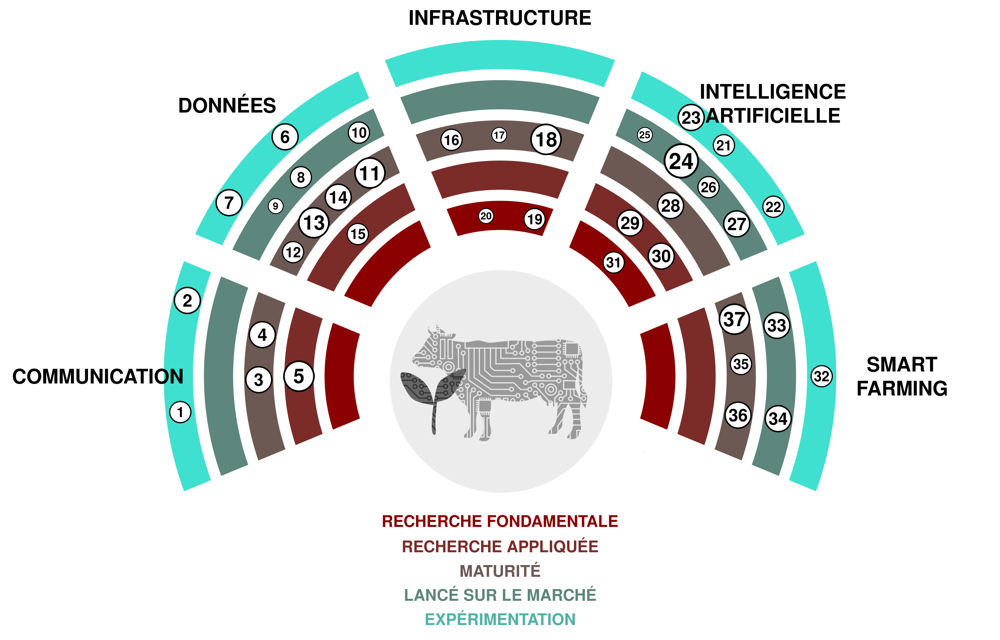

(1) ***Superintelligence*:** Un agent hypothétique ou système qui possède une intelligence surpassant de loin celle des êtres humains les plus brillants et doués dans pratiquement tous les domaines d'intérêt. 

(2) ***AGI*:** Abréviation d'intelligence artificielle générale. Un type hypothétique d'agent intelligent qui pourrait apprendre à accomplir n'importe quelle tâche intellectuelle que les êtres humains peuvent effectuer. 

(3) **Traduction de discours en temps réel:** Des outils qui permettent de traduire instantanément la parole d'une langue à une autre.  [SpeechTrans 🡥](https://speechtrans.com/)

(4) ***AutoML*:** Abrégé de *Automated Machine Learning*, cela fait référence au processus de sélection automatique et de réglage fin des modèles d'apprentissage automatique. Permet un ajustement de modèle économique partout où de petits ensembles de données sont disponibles. [R package automl 🡥](https://cran.r-project.org/web/packages/automl/)

(5) **Texte-à-parole:** Logiciel qui génère la parole à partir de texte écrit qui ressemble à celle des *êtres humains* (intéressants).  [OpenAIÕs TTS 🡥](https://platform.openai.com/docs/guides/text-to-speech)

(6) ***Large Language Models* de grande envergure:** Des systèmes d'*intelligence artificielle* capables de générer du texte écrit de manière similaire à un humain. Les LLMs peuvent aider avec la traduction, la reformulation, le brainstorming et bien plus encore. [ChatGPT 🡥](https://chat.openai.com/)

(7) **Reconnaissance Faciale:** Logiciel capable de mesurer la similarité des visages à partir d'images ou de vidéos, permettant ainsi la reconnaissance des visages.  [PimEyes 🡥](https://pimeyes.com/)

(8) **Modèles de Diffusion *Latent*:** Modèles capables de générer des images arbitraires à partir de textes, d'images ou de *inputs* de paramètres. Cela pourrait être utile pour trouver des images parfaitement adaptées pour les présentations. [Midjourney 🡥](https://www.midjourney.com/)

(9) **Discours-à-texte:** Modèles d'apprentissage automatique qui convertissent la parole de diverses langues en texte. Peut être utilisé pour la rédaction automatique de *protocol*. [Whisper 🡥](https://openai.com/research/whisper)

(10) **Grands Modèles *Multimodaux*:** Des systèmes avancés d'*intelligence artificielle* capables de traiter des informations provenant de multiples types de données, tels que le texte, les images, l'audio et la vidéo, en utilisant des modèles de langage pré-entraînés puissants comme composant central.  [GPT-4 🡥](https://openai.com/blog/chatgpt-can-now-see-hear-and-speak)

(11) **Traduction automatique:** Logiciel qui traduit automatiquement le texte d'une langue à une autre. Un tel logiciel peut rendre bien plus réalisable la publication de contenu dans toutes les langues nationales. [Deepl 🡥](https://deepl.com/)

(12) **Gestion et Surveillance des *Social Media*:** Suivre, analyser et répondre au contenu sur les plateformes de médias sociaux pour gérer la présence et la réputation en ligne d'une organisation ou d'un individu. 

(13) **Avatars du *Metaverse*:** Des avatars d'apparence réaliste qui permettent une présence apparemment naturelle dans le *Metaverse*. Cette technologie pourrait permettre une connexion plus directe lors de réunions à distance. [Interview 🡥](https://www.youtube.com/watch?v=MVYrJJNdrEg)

(14) ***TikTok*:** Plateforme de médias sociaux axée sur le contenu vidéo court, populaire pour sa large gamme de vidéos de musique, de danse, de comédie et de créativité générées par les utilisateurs, devenues populaires.  [TikTok 🡥](https://www.tiktok.com/)

(15) **Logiciel *Atlassian*:** Un ensemble d'outils utiles pour planifier, suivre, organiser le travail, créer des documentations et collaborer sur le *code*.  [Atlassian 🡥](https://www.atlassian.com/software)

(16) **Séquençage de *next generation*:** Technologie utilisée pour séquencer l'ADN ou l'ARN. Peut être utilisée dans plusieurs domaines de recherche comme l'étude des graines et des variétés de plantes.  [Illumina 🡥](https://emea.illumina.com/science/technology/next-generation-sequencing.html)

(17) ***Green-IT*:** Le Green IT fait référence à l'informatique écologiquement durable, axée sur la conception, la fabrication, l'utilisation et l'élimination efficaces et efficaces des ordinateurs, serveurs et sous-systèmes associés avec un impact minimal sur l'environnement. 

(18) **Jumeau *digital*:** Représentation virtuelle d'un système (par exemple, une ferme) basée sur des capteurs et des données en temps réel pour prendre des décisions basées sur les données. 

(19) ***Linked open data* ouvert lié:** Le Linked Open Data est une manière de publier et de connecter des données sur le web en utilisant des normes ouvertes et des URIs de sorte qu'elles peuvent être facilement accessibles, questionnées et enrichies par les humains et les machines. 

(20) ***ESG*:** Gouvernance environnementale, sociale et d'entreprise. Cadre pour évaluer une organisation en matière de normes environnementales, sociales et de gouvernance. 

(21) **Culture verticale:** Produire des plantes dans un environnement contrôlé et empilées les unes sur les autres. 

(22) **Données ouvertes du *gouvernement*:** Des données gouvernementales qui sont ouvertement accessibles au public.  [opendata.swiss 🡥](https://opendata.swiss)

(23) ***Resource Description Framework* (Cadre de Description des Ressources):** Cadre pour représenter des données interconnectées sur le web (web sémantique). Il est particulièrement destiné à représenter les métadonnées sur les ressources web. 

(24) ***i14y*:** *i14y* est la plateforme d'interopérabilité suisse et sert également de catalogue national de données pour la Suisse. Elle est maintenue par l'Office Fédéral de la Statistique. 

(25) **visualise.admin.ch:** Outil de visualisation pour les données ouvertes du gouvernement publiées sur *LINDAS*.  [visualize.admin.ch 🡥](https://www.visualize.admin.ch)

(26) **Stockage de données *biomoléculaires*:** Technologie innovante qui utilise des molécules biologiques, principalement l'ADN, pour stocker et récupérer des informations numériques, offrant potentiellement une haute densité et une préservation des données à long terme.  [CNET Article 🡥](https://www.cnet.com/tech/computing/startup-packs-all-16gb-wikipedia-onto-dna-strands-demonstrate-new-storage-tech/)

(27) ***Quantum-Computing*:** Un type de calcul qui utilise des phénomènes quantiques-mécaniques, tels que la *superposition* et l'*entanglement*, pour effectuer des opérations sur des données, potentiellement résolvant certains problèmes plus rapidement que les ordinateurs classiques. 

(28) ***GPU*-Clusters:** Grappe de serveurs équipée d'unités de traitement graphique. Utile pour entraîner et exécuter de grands modèles d'apprentissage automatique.  [AWS 🡥](https://aws.amazon.com/nvidia/)

(29) **Virtualisation des *Data*:** La virtualisation des données est une technologie qui permet la récupération et la manipulation des données sans nécessiter de détails techniques sur les données, tels que leur formatage ou leur emplacement physique. 

(30) ***Cloud computing*:** Fourniture de différents services via Internet, y compris le stockage de données, serveurs, bases de données, réseautage et logiciels, offrant souvent des ressources flexibles, une innovation plus rapide et des économies d'échelle. 

(31) **Étiquettes d'oreille *digital*:** Des *ear tags* qui permettent de suivre géographiquement les animaux de ferme. 

(32) **Fertilisation à taux variable:** Ajuster la quantité et le type d'engrais appliqué aux cultures en fonction des besoins spécifiques et des conditions de différentes zones au sein d'un champ. 

(33) **Robots de *désherbage*:** Des robots qui ciblent spécifiquement les mauvaises herbes dans un champ. Les mauvaises herbes peuvent être détruites à l'aide d'herbicides, de *hoes*, d'eau ou de lasers. 

(34) **Imagerie par *UAV*:** L'imagerie par UAV se réfère au processus de capture d'images et de vidéos depuis les airs à l'aide de véhicules aériens sans pilote (*UAV*), couramment utilisés pour des objectifs tels que la surveillance, la cartographie et la surveillance. 

(35) ***IoT*:** L'Internet des objets (IoT) fait référence au réseau d'objets incorporant des capteurs, des logiciels et d'autres technologies dans le but de se connecter et d'échanger des données avec d'autres dispositifs et systèmes via internet. 

(36) **Robots de *milking*:** Machine conçue pour gérer l'ensemble du processus de traite des vaches laitières, réduisant ainsi le besoin de main-d'œuvre humaine dans l'industrie *dairy farming*. Pourrait envoyer automatiquement les données de *milk* nécessaires à des fins administratives. [Moser Stalleinrichtungen 🡥](http://www.moser-stalleinrichtungen.ch)

(37) **Imagerie par *satellite*:** Implique la capture d'images de la Terre depuis des satellites en orbite, qui sont utilisés pour diverses fins. Pourrait être utilisé pour déterminer la période de couverture végétale par les données de *satellite*.