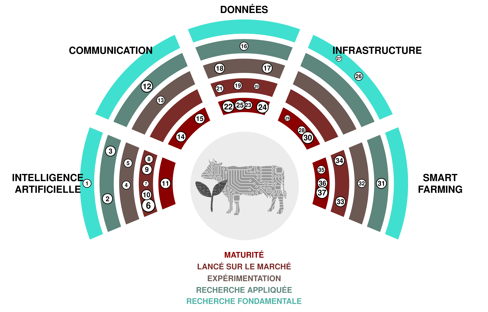

(1) **Avatars Réalistes du *Metaverse*:** Référez-vous à l'interview de Mark Zuckerberg avec Lex Fridman.

(2) **Plateformes multi-partenaires:** Agridata (*plateforme d'échange de données*)

(3) ***TikTok*:** Plateforme de médias sociaux basée sur la création, le visionnage et le partage de courtes vidéos. *TikTok* - Faites Votre Journée

(4) **Logiciel *Atlassian*:** Jira, Confluence, Bitbucket sont des technologies utiles, des outils pour la planification, le suivi, l'organisation du travail, la création de documents, et/ou la collaboration sur le code. Produits | Atlassian

(5) **Gestion et Surveillance des *Social Media*:** Analyse et comprendre ton impact sur les *médias sociaux*.

(6) **Green-IT:** Créer et développer des solutions pour réduire les impacts des activités humaines sur l'environnement ou prendre d'autres mesures écologiques dans le domaine de l'*IT*.

(7) **Jumeau numérique:** Représentation virtuelle d'un système (par exemple, une ferme) basée sur des capteurs et des données en temps réel pour prendre des décisions basées sur les données

(8) **Données ouvertes liées:** Le Linked Open Data est une manière de publier et de relier des données sur le web en utilisant des standards ouverts et des *URIs* de façon à ce qu'elles puissent être facilement accessibles, interrogées et enrichies par les humains et les machines.

(9) ***ESG*:** Environnemental, Social et Gouvernance d'Entreprise. Cadre pour évaluer une organisation en ce qui concerne les normes environnementales, sociales et de gouvernance.

(10) **L'agriculture *vertical*:** Produire des plantes dans un environnement strictement contrôlé. Les décisions concernant les ressources sont basées sur les *data*.

(11) **Données gouvernementales *open*:** Des données gouvernementales ouvertement accessibles au public. En Suisse, les données ouvertes du gouvernement disponibles sont répertoriées sur *opendata.swiss*.

(12) ***Resource Description Framework*:** Cadre pour représenter des données interconnectées sur le web (*semantic web*). Utilisé comme standard pour décrire et visualiser les métadonnées.

(13) **i14y:** Plateforme d'interopérabilité. Le catalogue national de données de *Switzerland*.

(14) **visualiser.admin.ch:** Outil de visualisation des données OGD sur LINDAS : *visualize.admin.ch*

(15) ***Séquençage* de nouvelle génération:** Technologie utilisée pour séquencer l'ADN, l'ARN. Peut être utilisée dans plusieurs domaines tels que l'étude des graines et des variétés de plantes, le contrôle des OGM. *Next-Generation Sequencing (NGS)* | Explorez la technologie (illumina.com)

(16) ***GPU*-Clusters:** Grappe d'ordinateurs où chaque nœud (au moins certains) sera équipé d'une unité de traitement graphique. Utile pour l'analyse IA. Exemples : *AWS* et *NVIDIA* (amazon.com), *Google Cloud*.

(17) ***Data Virtualization*:** You didn't provide an expression for translation.

(18) ***Cloud computing*:** You did not provide a text to translate. Please provide a text so I can assist you better.

(19) **Stockage de données *biomoléculaires*:** Le stockage de données dans l'ADN est une méthode prometteuse. L'ADN peut stocker une densité de 10¹⁹ bits de données par cm3, ce qui est bien supérieur aux méthodes de stockage actuelles. Les données seront stockées selon le code binaire où par exemple 00 -> A, 01 -> C, 10 -> G et T -> 11. L'ADN sera séquencé par NGS (Illumina). BioTech | Texte intégral gratuit | Stockage de données ADN (mdpi.com). Exemple : encodé 16GB de Wikipedia dans l'ADN. Startup emballe tous les 16GB de Wikipedia sur des brins d'ADN pour démontrer la nouvelle technologie de stockage - CNET

(20) ***Quantum-Computing*:** You did not provide an expression to translate.

(21) ***AutoML*:** Le principal avantage de l'Auto-ML réside dans le gain de temps lors du traitement des données et des phases de test nécessaires pour mettre en service un modèle *AI* suffisamment performant.

(22) **texte à _text2speech_:** Logiciel qui génère de la parole à partir de texte écrit qui semble être celle d'êtres humains (intéressants). <https://openai.com/blog/chatgpt-can-now-see-hear-and-speak>

(23) **Grands Modèles *Multimodaux*:** Les *Large Multimodal Models* (LMM) sont des systèmes avancés d'intelligence artificielle capables de traiter et de générer des informations à partir de multiples types de données, tels que le texte, les images, l'audio et la vidéo, en utilisant de puissants modèles linguistiques pré-entraînés comme composant central.

(24) ***Large Language Models* de grande taille:** Des modèles d'apprentissage automatique capables de générer du texte écrit de manière semblable à l'humain. *GPT-3.5, GPT-4, Bard, Claude 2, LLAMA*.

(25) **Reconnaissance faciale:** Un logiciel qui peut mesurer la similarité des visages à partir d'images ou de vidéos, permettant ainsi la reconnaissance des visages. <http://clearview.ai> <https://pimeyes.com>

(26) **Modèles de Diffusion *Latent*:** Modèles de réseaux neuronaux permettant la synthèse d'images haute résolution en utilisant moins de ressources que d'autres méthodes (*GAN, VAE, ARM*). Peut générer des images à partir de texte, supprimer des objets sur des images. GitHub - CompVis/latent-diffusion : Synthèse d'images haute résolution avec les modèles à diffusion latente.

(27) **discours2texte:** Modèles d'apprentissage automatique qui convertissent la parole de diverses langues en texte. *Speech2Text-App*

(28) **Traduction Automatique:** Un logiciel qui traduit automatiquement le texte d'une langue à une autre. <https://www.deepl.com>

(29) ***AGI*:** Intelligence Artificielle Générale. Un type hypothétique d'agent intelligent qui peut apprendre à accomplir n'importe quelle tâche intellectuelle que peuvent effectuer les êtres humains ou les animaux .

(30) **Traduction de discours en temps réel:** Les outils utilisant la traduction automatique neuronale (NTM) permettent de traduire instantanément un discours d'une langue à une autre. Exemple : *SpeechTrans*

(31) ***Superintelligence*:** Un agent hypothétique ou système qui possède une intelligence surpassant de loin celle des esprits humains les plus brillants et les plus doués dans pratiquement tous les domaines d'intérêt.

(32) **Fertilisation à taux variable:** Égal, mais pour la *Düngung*

(33) **Robots de *weeding*:** Pulvérisation intelligente pour le traitement local de vos cultures en rangées, *grasses* et pelouses

(34) **Imagerie par *UAV*:** Prises de vue aérienne par des drones. Peuvent être utilisées pour détecter le stress hydrique ou créer des cartes de nutriments.

(35) ***IoT*:** Réseau d'appareils qui collectent des données.

(36) **Robots de traite:** You forgot to provide the expression that needs to be translated.

(37) **Imagerie par *satellite*:** Des cas d'utilisation tels que la détermination de la période de couverture végétale par des données de *satellite*.