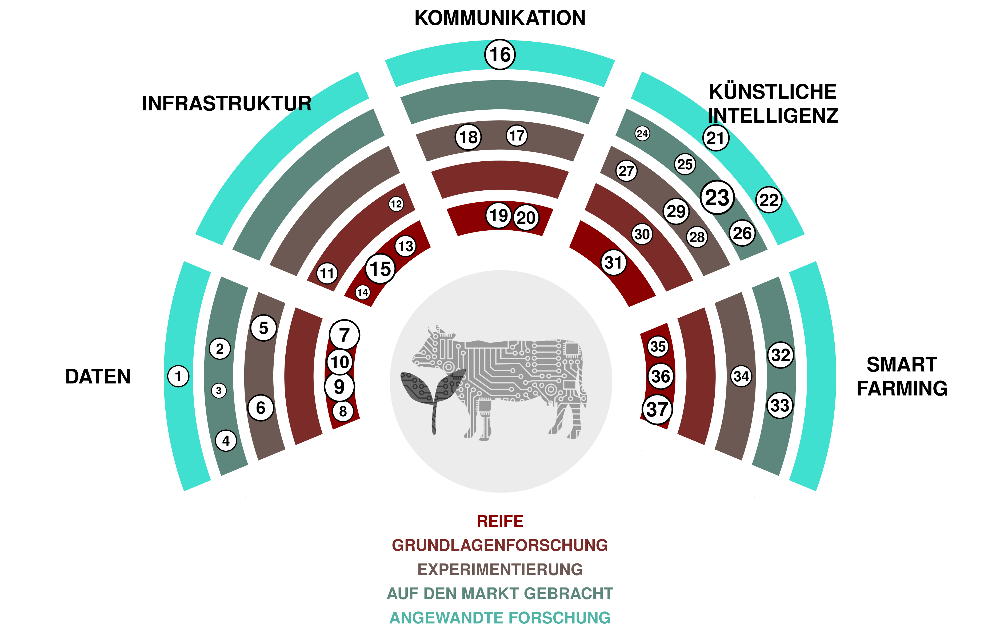

(1) **Superintelligenz:** Ein hypothetischer Agent oder System, das eine Intelligenz besitzt, die die des intelligentesten und begabtesten Menschen in nahezu allen Interessensgebieten weit übertrifft. I'm sorry, but there is no expression provided in your request to translate into German. Could you please provide the expression you'd like translated?

(2) ***AGI*:** Abkürzung für allgemeine künstliche Intelligenz. Eine hypothetische Art von intelligentem Agenten, der lernen kann, jede intellektuelle Aufgabe zu erfüllen, die ein Mensch ausführen kann. You did not provide a specific expression to be translated into German.

(3) **Echtzeit-Sprachübersetzung:** Werkzeuge, die es ermöglichen, Sprache sofort von einer Sprache in eine andere zu übersetzen. You didn't provide an expression to be translated into German. Could you please provide the necessary information? [SpeechTrans 🡥](https://speechtrans.com/)

(4) ***AutoML*:** Abkürzung für *Automated Machine Learning*, bezieht sich auf den Prozess der automatischen Auswahl und Feinabstimmung von Machine-Learning-Modellen. Ermöglicht kostengünstige Modellanpassung, wo immer kleine Datensätze verfügbar sind. [R package automl 🡥](https://cran.r-project.org/web/packages/automl/)

(5) **Text-zu-Sprache:** Software, die aus geschriebenem Text Sprache erzeugt, die wie (interessante) Menschen klingt. You didn't provide any expression to translate. Please provide the content you want translated. [OpenAI’s TTS 🡥](https://platform.openai.com/docs/guides/text-to-speech)

(6) **Große Sprachmodelle:** Künstliche Intelligenzsysteme, die in der Lage sind, Texte in einer *human-like* Manier zu generieren. You didn't provide any expression to translate. [ChatGPT 🡥](https://chat.openai.com/)

(7) **Gesichtserkennung:** Software, die die Ähnlichkeit von Gesichtern aus Bildern oder Videos messen kann, also Gesichter erkennen kann. Expression was not provided in the prompt. [PimEyes 🡥](https://pimeyes.com/)

(8) **Latente Diffusionsmodelle:** Modelle, die beliebige Bilder aus Text-, Bild- oder Parameter-Eingaben generieren. You did not provide any expression to translate. [Midjourney 🡥](https://www.midjourney.com/)

(9) **Sprache-zu-Text:** Maschinelles Lernmodelle, die Sprache verschiedener Sprachen in Text umwandeln. You didn't provide an expression to translate. [Whisper 🡥](https://openai.com/research/whisper)

(10) **Große Multimodale Modelle:** Fortgeschrittene künstliche Intelligenzsysteme, die in der Lage sind, Informationen aus verschiedenen Arten von Daten, wie Text, Bildern, Audio und Video, zu verarbeiten, wobei sie leistungsstarke vortrainierte Sprachmodelle als Kernelement nutzen. You didn't provide an expression to translate. [GPT-4 🡥](https://openai.com/blog/chatgpt-can-now-see-hear-and-speak)

(11) **Maschinenübersetzung:** Software, die Text automatisch von einer Sprache in eine andere übersetzt. Solche Software kann es deutlich machbarer machen, Inhalte in allen *national languages* zu veröffentlichen. [Deepl 🡥](https://deepl.com/)

(12) **Social Media Management und Überwachung:** Inhalte auf sozialen Medien verfolgen, analysieren und darauf reagieren, um die Online-Präsenz und den Ruf einer Organisation oder Einzelperson zu verwalten. You didn't provide an expression to translate.

(13) **Metaverse-Avatare:** Realistisch aussehende Avatare, die eine scheinbar natürliche Präsenz im *Metaverse* ermöglichen. Diese Technologie könnte eine direktere Verbindung bei *remote meetings* ermöglichen. [Interview 🡥](https://www.youtube.com/watch?v=MVYrJJNdrEg)

(14) ***TikTok*:** Soziale Medien Plattform, die sich auf kurze Videoinhalte konzentriert und beliebt ist für ihre breite Palette an nutzergenerierten Musik-, Tanz-, Comedy- und kreativen Videos. You didn't provide any expression to translate. [TikTok 🡥](https://www.tiktok.com/)

(15) **Atlassian-Software:** Ein Set nützlicher Tools zur Planung, Verfolgung, Organisation von Arbeit, Erstellung von Dokumentationen und Zusammenarbeit an *Code*. You didn't provide any expression to translate into German. [Atlassian 🡥](https://www.atlassian.com/software)

(16) **Next-Generation-Sequenzierung:** Technologie, die zur Sequenzierung von DNA oder RNA verwendet wird. Kann in mehreren Forschungsbereichen eingesetzt werden, wie zum Beispiel bei der Untersuchung von *Seeds* und Pflanzensorten. You failed to provide any expression that needs to be translated into German. Could you please provide the necessary information? [Illumina 🡥](https://emea.illumina.com/science/technology/next-generation-sequencing.html)

(17) **Green-IT:** Green IT bezieht sich auf umweltverträgliche Informatik, die sich auf das Entwerfen, Herstellen, Verwenden und Entsorgen von Computern, Servern und zugehörigen Subsystemen konzentriert, effizient und effektiv mit minimalen Auswirkungen auf die Umwelt. You haven't provided any expression/text that needs to be translated into German. Please provide the text to proceed.

(18) **Digitaler Zwilling:** Virtuelle Darstellung eines Systems (z.B. einer Farm) basierend auf Sensoren und Echtzeitdaten, um datengesteuerte Entscheidungen zu treffen. The assistant didn't provide a sentence or phrase to translate.

(19) **Verknüpfte offene Daten:** Linked Open Data ist eine Methode, Daten im Web zu veröffentlichen und mithilfe offener Standards und *URIs* zu verknüpfen, sodass sie einfach von Menschen und Maschinen abgerufen, abgefragt und angereichert werden können. Sorry, you didn't provide any text or expression to translate.

(20) ***ESG*:** Umwelt-, Sozial- und Unternehmensführung. Rahmen zur Bewertung einer Organisation hinsichtlich Umwelt-, Sozial- und Governance-Standards. (No expression was provided within the instruction to translate)

(21) ***Vertical Farming*:** Pflanzen in einer kontrollierten Umgebung produzieren und übereinander gestapelt. You didn't provide any expression to be translated. Could you please specify the text you want to be translated into German?

(22) **Offene Regierungsdaten:** Von der Regierung bereitgestellte Daten, die öffentlich zugänglich sind. You didn't provide any expression to translate. Could you please provide the expression you are trying to translate? [opendata.swiss 🡥](https://opendata.swiss)

(23) **Resource Description Framework:** Rahmenwerk zur Darstellung von vernetzten Daten im Web (Semantic Web). Es ist insbesondere für die Darstellung von Metadaten über Webressourcen vorgesehen. You didn't provide an expression to translate. Please try again.

(24) ***i14y*:** i14y ist die Schweizer Plattform für Interoperabilität und fungiert zudem als nationaler Datenkatalog der Schweiz. Sie wird vom Bundesamt für Statistik gepflegt. You didn't provide any expression to translate. Please provide one.

(25) **visualize.admin.ch:** Visualisierungstool für offene Regierungsdaten, die auf *LINDAS* veröffentlicht wurden. You didn't provide an expression to translate. Please provide the text you want to translate into German. [visualize.admin.ch 🡥](https://www.visualize.admin.ch)

(26) **Biomolekularer Datenspeicherung:** Innovative Technologie, die biologische Moleküle, hauptsächlich DNA, nutzt, um digitale Informationen zu speichern und abzurufen und potenziell hohe Dichte und langfristige Datenerhaltung bietet. You didn't provide any text or expression to translate. Please provide the necessary information. [CNET Article 🡥](https://www.cnet.com/tech/computing/startup-packs-all-16gb-wikipedia-onto-dna-strands-demonstrate-new-storage-tech/)

(27) **Quantum-Computing:** Eine Art des Rechnens, die quantenmechanische Phänomene, wie *Superposition* und *Verschränkung*, verwendet, um Operationen mit Daten durchzuführen, und potenziell bestimmte Probleme schneller als klassische Computer löst. You didn't provide an expression to translate. Could you please provide it?

(28) ***GPU*-Cluster:** Computercluster, das mit *graphical processing units* ausgestattet ist. Nützlich für das Training und Ausführen von großen Machine-Learning-Modellen. You didn't provide an expression to translate. [AWS 🡥](https://aws.amazon.com/nvidia/)

(29) ***Daten-Virtualisierung*:** Data Virtualisierung ist eine Technologie, die das Abrufen und Manipulieren von Daten ermöglicht, ohne technische Details über die Daten zu benötigen, wie zum Beispiel deren Formatierung oder ihren physischen Speicherort. I'm sorry, but I need the expression you want me to translate into German.

(30) ***Cloud Computing*:** Lieferung verschiedener Dienstleistungen über das Internet, einschließlich Datenspeicherung, Server, Datenbanken, Netzwerken und Software, oft mit flexiblen Ressourcen, schnellerer Innovation und *economies of scale*. You did not provide any expression for translation.

(31) **Digitale *Ear Tags*:** Ohrmarken, die es ermöglichen, Nutztiere geografisch zu verfolgen. You didn't provide an expression for translation.

(32) **Düngung mit variabler Rate:** Die Menge und Art des auf die Feldfrüchte angewandten Düngers anpassen, basierend auf den spezifischen Bedürfnissen und Zuständen verschiedener Gebiete innerhalb eines *Feldes*. You didn't provide any text to translate. Please provide the expression that you want to be translated into German.

(33) **Unkrautentfernende Roboter:** Roboter, die gezielt Unkräuter auf einem Feld angreifen. Unkräuter können mit Herbiziden, Hacken, Wasser oder *Lasern* vernichtet werden. Expression was not provided.

(34) **UAV-Bildgebung:** UAV-Bildgebung bezieht sich auf den Prozess der Erfassung von Bildern und Videos aus der Luft mit Hilfe von unbemannten Luftfahrzeugen (UAV), die häufig für Zwecke wie Vermessung, Kartierung und Überwachung verwendet werden. Sorry, you didn't provide any expression. Could you please provide the expression you want to translate into German?

(35) ***IoT*:** Das Internet der Dinge (IoT) bezieht sich auf das Netzwerk von Objekten, die mit Sensoren, Software und anderen Technologien ausgestattet sind, um Daten mit anderen Geräten und Systemen über das Internet zu verbinden und auszutauschen. You did not provide any text to translate.

(36) **Melkroboter:** Maschine konzipiert, um den gesamten Prozess des Melkens von Milchkühen zu bewältigen, wodurch der Bedarf an menschlicher Arbeit in der Milchviehwirtschaft reduziert wird. Könnte automatisch notwendige Milchdaten für Verwaltungszwecke senden. [Moser Stalleinrichtungen 🡥](http://www.moser-stalleinrichtungen.ch)

(37) **Satellitenbildgebung:** Betrifft die Erfassung von Bildern der Erde von umlaufenden Satelliten, die für verschiedene Zwecke verwendet werden. Könnte verwendet werden, um die Vegetationsbedeckungsperiode mit Hilfe von Satellitendaten zu bestimmen.