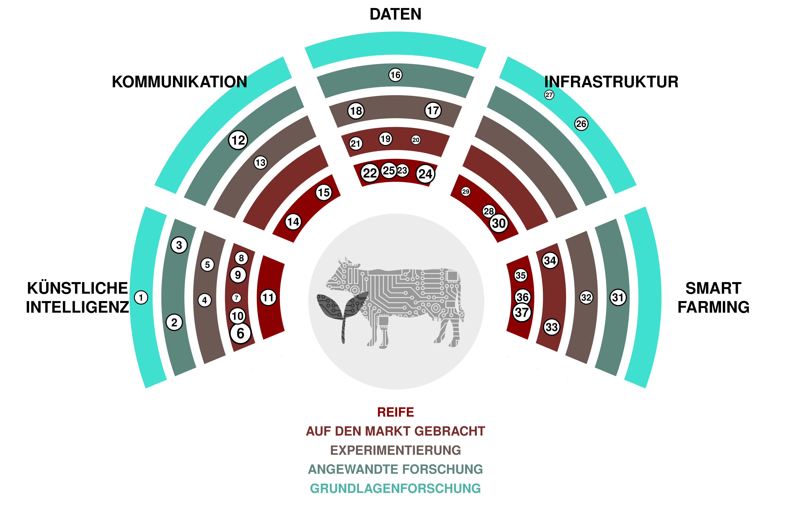

(1) ***Superintelligenz*:** Ein hypothetischer Agent oder System, der über eine Intelligenz verfügt, die bei weitem die der hellsten und begabtesten Menschen in nahezu allen *Domains of Interest* übertrifft. 

(2) ***AGI*:** Kurz für künstliche allgemeine Intelligenz. Ein hypothetischer Typ intelligenter Agenten, der lernen kann, jede intellektuelle Aufgabe zu erfüllen, die ein Mensch erfüllen kann. 

(3) **Echtzeit-Sprachübersetzung:** Tools, die es ermöglichen, Sprache *instantly* von einer Sprache in eine andere zu übersetzen.  [SpeechTrans 🡥](https://speechtrans.com/)

(4) ***AutoML*:** Kurz für *Automated Machine Learning*, bezieht sich auf den Prozess der automatischen Auswahl und Feinabstimmung von Maschinenlernmodellen. Allows for cheap model fitting wherever small data sets are available. [R package automl 🡥](https://cran.r-project.org/web/packages/automl/)

(5) **Text-zu-Sprache:** Software, die gesprochene Sprache aus geschriebenem Text erzeugt, die wie (interessante) Menschen klingt.  [OpenAI’s TTS 🡥](https://platform.openai.com/docs/guides/text-to-speech)

(6) **Große Sprachmodelle:** Künstliche Intelligenzsysteme, die in der Lage sind, *written text* auf menschenähnliche Art und Weise zu erzeugen.  [ChatGPT 🡥](https://chat.openai.com/)

(7) **Gesichtserkennung:** Software, die die Ähnlichkeit von Gesichtern aus Bildern oder Videos messen kann und somit Gesichter erkennt.  [PimEyes 🡥](https://pimeyes.com/)

(8) **Latente Diffusionsmodelle:** Modelle, die beliebige Bilder aus Text-, Bild- oder Parameter-Eingaben generieren.  [Midjourney 🡥](https://www.midjourney.com/)

(9) **Sprache-zu-Text:** Maschinelles Lernen Modelle, die Sprache verschiedener Sprachen in Text umwandeln.  [Whisper 🡥](https://openai.com/research/whisper)

(10) **Große Multimodale Modelle:** Fortgeschrittene künstliche Intelligenzsysteme, die Informationen aus verschiedenen Arten von Daten, wie Text, Bildern, Audio und Video, verarbeiten können, indem sie leistungsstarke vortrainierte Sprachmodelle als Kernkomponente verwenden.  [GPT-4 🡥](https://openai.com/blog/chatgpt-can-now-see-hear-and-speak)

(11) **Maschinenübersetzung:** Software, die Text automatisch von einer Sprache in eine andere übersetzt. Such software can make it much more feasible to publish content to all national languages. [Deepl 🡥](https://deepl.com/)

(12) **Social Media Management und Überwachung:** Das Verfolgen, Analysieren und Reagieren auf Inhalte auf sozialen Medien Plattformen, um die Online-Präsenz und den Ruf einer Organisation oder Einzelperson zu verwalten. 

(13) ***Metaverse* Avatars:** Realistisch aussehende Avatare, die eine scheinbar natürliche Präsenz im *Metaverse* ermöglichen. This technology could allow for a more direct connection during remote meetings. [Interview 🡥](https://www.youtube.com/watch?v=MVYrJJNdrEg)

(14) ***TikTok*:** Soziale Medien Plattform, die sich auf kurze Videoinhalte konzentriert und beliebt ist für ihre breite Palette an nutzergenerierten Musik-, Tanz-, Comedy- und kreativen Videos.  [TikTok 🡥](https://www.tiktok.com/)

(15) **Atlassian Software:** Ein Satz nützlicher Werkzeuge für die Planung, Verfolgung, Organisation von Arbeit, Erstellung von Dokumentationen und Zusammenarbeit an *Code*.  [Atlassian 🡥](https://www.atlassian.com/software)

(16) **Next-Generation-Sequenzierung:** Technologie zur Sequenzierung von DNA oder RNA. Kann in mehreren Forschungsbereichen verwendet werden, wie beispielsweise der Untersuchung von Samen und Pflanzensorten.  [Illumina 🡥](https://emea.illumina.com/science/technology/next-generation-sequencing.html)

(17) **Grüne-IT:** Green IT bezieht sich auf umweltverträgliche Informatik, die sich auf das Entwerfen, Herstellen, Verwenden und Entsorgen von Computern, Servern und zugehörigen *Subsystemen* konzentriert, effizient und effektiv mit minimaler Auswirkung auf die Umwelt. 

(18) **Digitaler Zwilling:** Virtuelle Darstellung eines Systems (z.B. eines Bauernhofs) auf der Grundlage von Sensoren und Echtzeitdaten, um datengesteuerte Entscheidungen zu treffen. 

(19) **Verknüpfte offene Daten:** Linked Open Data ist eine Methode zur Veröffentlichung und Verknüpfung von Daten im Internet unter Verwendung offener Standards und *URIs*, so dass sie von Menschen und Maschinen leicht zugänglich gemacht, abgefragt und bereichert werden können. 

(20) ***ESG*:** Umwelt-, Sozial- und Unternehmensführung. Rahmenwerk zur Bewertung einer Organisation hinsichtlich umweltbezogener, sozialer und *governance*-Standards. 

(21) **Vertikale Landwirtschaft:** Pflanzen in einer kontrollierten Umgebung produzieren und übereinander gestapelt. 

(22) **Offene Regierungsdaten:** Daten der Regierung, die öffentlich zugänglich sind.  [opendata.swiss 🡥](https://opendata.swiss)

(23) **_Ressource Description Framework_:** Framework zur Darstellung vernetzter Daten im Web (semantic web). Es ist besonders für die Darstellung von Metadaten über Webressourcen gedacht. 

(24) ***i14y*:** i14y ist die Schweizer Plattform für Interoperabilität und dient auch als nationaler Datenkatalog der Schweiz. Sie wird vom Bundesamt für Statistik gepflegt. 

(25) **visualize.admin.ch:** Visualisierungstool für offene Regierungsdaten, die auf LINDAS veröffentlicht wurden.  [visualize.admin.ch 🡥](https://www.visualize.admin.ch)

(26) **Biomolekulare Datenspeicherung:** Innovative Technologie, die biologische Moleküle, hauptsächlich DNA, zur Speicherung und Abruf digitaler Informationen nutzt und potenziell hohe Dichte und langfristige Datenbewahrung bietet.  [CNET Article 🡥](https://www.cnet.com/tech/computing/startup-packs-all-16gb-wikipedia-onto-dna-strands-demonstrate-new-storage-tech/)

(27) **Quanten-Computing:** Eine Art des Rechnens, die quantenmechanische Phänomene, wie etwa *Superposition* und *Verschränkung*, nutzt, um Operationen auf Daten durchzuführen und potenziell bestimmte Probleme schneller als klassische Computer zu lösen. 

(28) ***GPU*-Cluster:** Computer-Cluster, ausgestattet mit *graphical processing units*. Nützlich für das Training und Ausführen großer Maschinenlernmodelle.  [AWS 🡥](https://aws.amazon.com/nvidia/)

(29) **Daten-*Virtualisierung*:** Data Virtualisierung ist eine Technologie, die das Abrufen und Manipulieren von Daten ermöglicht, ohne technische Details über die Daten zu benötigen, wie zum Beispiel, in welchem Format sie vorliegen oder wo sie physisch gespeichert sind. 

(30) ***Cloud Computing*:** Lieferung verschiedener Dienstleistungen über das Internet, einschließlich Datenspeicherung, Servern, Datenbanken, Networking und Software, die oft flexible Ressourcen, schnellere Innovation und *economies of scale* bieten. 

(31) **Digitale Ohrmarken:** Ohrmarken, die es ermöglichen, Nutztiere geografisch zu verfolgen. 

(32) **Variable Rate-Düngung:** Die Anpassung der Menge und Art des Düngemittels, das auf die Kulturen aufgebracht wird, basierend auf den spezifischen Bedürfnissen und Bedingungen verschiedener Bereiche innerhalb eines Feldes. 

(33) **Unkrautentfernungs-Roboter:** Roboter, die gezielt Unkraut auf einem Feld bekämpfen. Unkraut kann mit Hilfe von Herbiziden, Hacken, Wasser oder *Lasern* vernichtet werden. 

(34) **UAV-Bildgebung:** UAV-Bildgebung bezieht sich auf den Prozess der Erfassung von Bildern und Videos aus der Luft mithilfe von unbemannten Luftfahrzeugen (UAV). Diese werden häufig für Zwecke wie Vermessung, Kartierung und Überwachung verwendet. 

(35) ***IoT*:** Das Internet der Dinge (IoT) bezieht sich auf das Netzwerk von Objekten, die mit Sensoren, Software und anderen Technologien ausgestattet sind, um eine Verbindung herzustellen und Daten mit anderen Geräten und Systemen über das Internet auszutauschen. 

(36) **Melkroboter:** Maschine entworfen, um den gesamten Prozess des Melkens von Milchkühen zu bewältigen, wodurch der Bedarf an menschlicher Arbeit in der Milchwirtschaft reduziert wird. Could automatically send milk data needed for administrative purposes. [Moser Stalleinrichtungen 🡥](http://www.moser-stalleinrichtungen.ch)

(37) **Satellitenbildgebung:** Beinhaltet das Aufnehmen von Bildern der Erde von *orbiting satellites*, die für verschiedene Zwecke verwendet werden. Could be used to determine the vegetation cover period by satellite data.

(38) **Satellitenbildgebung:** Satellitenbildgebung beinhaltet das Erfassen von Bildern der Erde durch umlaufende Satelliten. Diese werden zu verschiedenen Zwecken genutzt, wie zum Beispiel Wettervorhersage, Kartierung und Umweltüberwachung. Could be used to determine the vegetation cover period by satellite data.