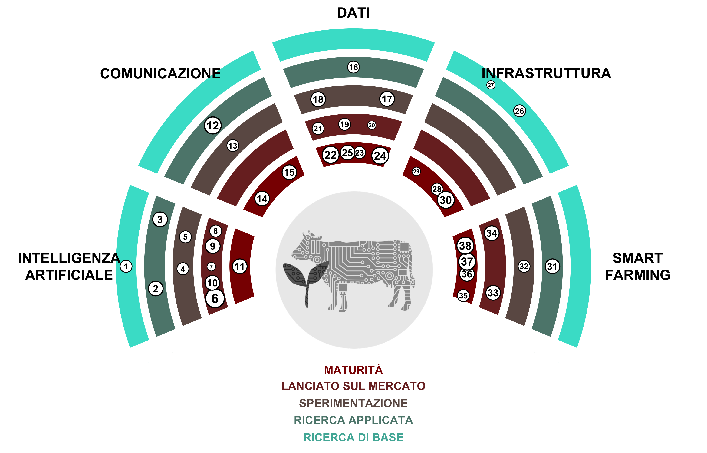

(1) **Superintelligenza:** Un agente o sistema ipotetico che possiede un'intelligenza che supera di gran lunga quella degli esseri umani più brillanti e dotati in quasi tutti i campi d'interesse. You didn't provide any expression to be translated in Italian. Please write down the expression to continue.

(2) ***AGI*:** Abbreviazione per intelligenza artificiale generale. Un tipo ipotetico di agente intelligente che può imparare a svolgere qualsiasi compito intellettuale che gli esseri umani possono eseguire. You didn't provide an expression to translate. Please specify the expression.

(3) **Traduzione vocale in tempo reale:** Strumenti che permettono di tradurre istantaneamente il discorso da una lingua all'altra. You forgot to provide an expression to translate. [SpeechTrans 🡥](https://speechtrans.com/)

(4) **AutoML:** Acronimo di Automated Machine Learning, si riferisce al processo di selezione automatica e ottimizzazione dei modelli di *machine learning*. Consente un adattamento economico del modelor dovunque siano disponibili piccoli set di dati. [R package automl 🡥](https://cran.r-project.org/web/packages/automl/)

(5) **Testo-parlato:** Software che genera discorsi da testi scritti che suonano come essere umani (interessanti). You didn't provide a text or expression for translation. Could you please do that? [OpenAI’s TTS 🡥](https://platform.openai.com/docs/guides/text-to-speech)

(6) **Modelli Linguistici di Grande Dimensione:** Sistemi di intelligenza artificiale che sono in grado di generare testi scritti in modo similare all'*uomo*. You did not provide any expression to translate. Please provide the required information. [ChatGPT 🡥](https://chat.openai.com/)

(7) **Riconoscimento Facciale:** Software che può misurare la somiglianza di volti da immagini o video, riconoscendo così i visi. \Memories warm you up from the inside. But they also tear you apart.\

\I ricordi ti scaldano dall'interno. Ma ti lacerano anche.\ [PimEyes 🡥](https://pimeyes.com/)

(8) **Modelli di Diffusione Latente:** Modelli che generano immagini arbitrarie da input di testo, immagine o parametri. You did not provide any expression or sentence to translate. Please provide it so I can assist you better. [Midjourney 🡥](https://www.midjourney.com/)

(9) **Da voce a testo:** Modelli di *machine learning* che convertono il discorso di varie lingue in testo. You didn't provide an expression to translate. Please provide the text you want translated into Italian. [Whisper 🡥](https://openai.com/research/whisper)

(10) **Grandi Modelli *Multimodal*:** Sistemi avanzati di intelligenza artificiale in grado di elaborare informazioni provenienti da molteplici tipi di dati, come testo, immagini, audio e video, utilizzando potenti modelli di lingua pre-addestrati come componente fondamentale. You did not provide any expression or phrase to translate into Italian. Please provide the text that needs to be translated. [GPT-4 🡥](https://openai.com/blog/chatgpt-can-now-see-hear-and-speak)

(11) **Traduzione Automatica:** Software che traduce automaticamente il testo da una lingua all'altra. Tale software può rendere molto più fattibile la pubblicazione di contenuti in tutte le lingue nazionali. [Deepl 🡥](https://deepl.com/)

(12) **Gestione e Monitoraggio dei *Social Media*:** Tracciamento, analisi e risposta ai contenuti sulle piattaforme di social media per gestire la presenza e la reputazione online di un'organizzazione o di un individuo. You didn't provide any expression to translate. Can you please mention the phrase or sentence that needs to be translated into Italian?

(13) **Avatar del Metaverse:** Avatar dall'aspetto realistico che permettono una presenza apparentemente naturale nel *Metaverse*. Questa tecnologia potrebbe permettere una connessione più diretta durante le riunioni *remote*. [Interview 🡥](https://www.youtube.com/watch?v=MVYrJJNdrEg)

(14) **TikTok:** Piattaforma di social media centrata sui contenuti video di breve durata, popolare per la sua vasta gamma di video musicali, di danza, comici e creativi generati dagli utenti. You didn't provide any text to translate. Could you please provide the text you want to translate into Italian? [TikTok 🡥](https://www.tiktok.com/)

(15) **Software Atlassian:** Un insieme di strumenti utili per pianificare, monitorare, organizzare il lavoro, creare documentazioni e collaborare sul *code*. You have not provided any text or expression for translation. Please provide the sentence or phrase you'd like translated into Italian. [Atlassian 🡥](https://www.atlassian.com/software)

(16) **Sequenziamento di prossima generazione:** Tecnologia utilizzata per sequenziare il DNA o l'RNA. Può essere utilizzata in diversi campi di ricerca come lo studio dei semi e delle varietà di piante. You did not provide any text to translate. Could you please provide the phrase or sentence you need translated into Italian? [Illumina 🡥](https://emea.illumina.com/science/technology/next-generation-sequencing.html)

(17) ***Green-IT*:** Green IT si riferisce al calcolo ecologicamente sostenibile, concentrato sulla progettazione, produzione, utilizzo e smaltimento di computer, server e sottosistemi associati in modo efficiente ed efficace con un impatto minimo sull'ambiente. You haven't provided an expression to translate. Could you please provide one?

(18) **Gemello digitale:** Rappresentazione virtuale di un sistema (ad esempio, una fattoria) basata su sensori e dati in tempo reale per prendere decisioni basate sui dati. As an AI model developed by OpenAI, your request is missing the expression you want me to translate. Please provide the expression for translation.

(19) **Dati aperti collegati:** Linked Open Data è un metodo di pubblicazione e connessione di dati sul web utilizzando standard aperti e URI in modo tale che possa essere facilmente accessibile, interrogabile e arricchito sia da esseri umani che da macchine. Expression: \With the right approach, even the most challenging tasks become a cakewalk.\

Translation: \Con il giusto approccio, anche i compiti più impegnativi diventano una *cakewalk*.\

(20) ***ESG*:** Ambientale, Sociale e Governance Aziendale. Struttura per valutare un'organizzazione riguardo agli standard ambientali, sociali e di governance. You didn't provide an expression to translate. Please provide the text for translation.

(21) **Coltivazione verticale:** Producendo piante in un ambiente controllato e impilate l'una sull'altra. You have not provided an expression to translate into Italian. Please provide the expression to proceed.

(22) **Dati aperti del governo:** Dati governativi che sono apertamente accessibili al pubblico. You didn't provide any expression that needs to be translated. Please provide the expression. [opendata.swiss 🡥](https://opendata.swiss)

(23) ***Resource Description Framework*:** Struttura per rappresentare dati interconnessi sul web (web semantico). È particolarmente pensata per rappresentare metadati relativi alle risorse web. You did not provide an expression to translate. Please provide the expression you want translated into Italian.

(24) ***i14y*:** i14y è la piattaforma svizzera per l'interoperabilità e funge anche da catalogo nazionale dei dati della Svizzera. È gestita dall'Ufficio Federale di Statistica. You did not provide a specific text or expression to translate. Please provide the necessary details.

(25) ***visualize.admin.ch*:** Strumento di visualizzazione per i dati governativi aperti pubblicati su *LINDAS*. You didn't provide any text to translate. Could you please clarify what expression you would like to translate into Italian? [visualize.admin.ch 🡥](https://www.visualize.admin.ch)

(26) **Archiviazione di dati biomolecolari:** Tecnologia innovativa che utilizza molecole biologiche, principalmente il DNA, per memorizzare e recuperare informazioni digitali, offrendo potenzialmente alta densità e conservazione dei dati a lungo termine. You didn't provide any text to translate. Please provide the text you want to translate to Italian. [CNET Article 🡥](https://www.cnet.com/tech/computing/startup-packs-all-16gb-wikipedia-onto-dna-strands-demonstrate-new-storage-tech/)

(27) ***Quantum-Computing*:** Un tipo di calcolo che utilizza fenomeni quantistico-meccanici, come la *superposition* e l'*entanglement*, per eseguire operazioni sui dati, potenzialmente risolvendo certi problemi più velocemente dei computer classici. Expression: \An act of kindness repays itself.\

Italian Translation: \Un atto di gentilezza si ripaga da solo.\

(28) ***GPU-Clusters*:** Gruppo di computer equipaggiato con unità di elaborazione grafica. Utile per l'allenamento e l'esecuzione di grandi modelli di *machine learning*. You did not provide any expression or text that needs to be translated to Italian. [AWS 🡥](https://aws.amazon.com/nvidia/)

(29) **Virtualizzazione dei Dati:** La virtualizzazione dei dati è una tecnologia che consente il recupero e la manipolazione dei dati senza richiedere dettagli tecnici sui dati, come il loro formato o dove sono fisicamente ubicati. You did not provide any text to translate.

(30) ***Cloud computing*:** Consegna di diversi servizi attraverso Internet, tra cui memorizzazione di dati, *servers*, *databases*, *networking* e software, spesso fornendo risorse flessibili, innovazione più rapida e economie di scala. You did not provide any phrase or expression to translate into Italian. Please try again.

(31) **Etichette digitali per l'orecchio:** Etichette auricolari che permettono di tracciare geograficamente gli animali da fattoria. You didn't provide an expression for translation. Please provide the expression that you would like translated to Italian.

(32) **Fertilizzazione a tasso variabile:** Regolando la quantità e il tipo di fertilizzante applicato alle colture in base alle specifiche esigenze e condizioni di diverse aree all'interno di un campo. Could you please provide the expression you'd like to be translated into Italian?

(33) **Robot per la diserbo:** Robot che mirano specificamente alle erbacce in un campo. Le erbacce possono essere distrutte utilizzando erbicidi, zappe, acqua o laser. Could you provide the text or expression that needs to be translated?

(34) **Immagini *UAV*:** L'imaging UAV si riferisce al processo di cattura di immagini e video dall'aria utilizzando veicoli aerei non pilotati (*UAV*), comunemente utilizzati per scopi come rilevamento, mappatura e sorveglianza. You failed to provide a text or expression that needs to be translated. Please redo your request.

(35) ***IoT*:** L'Internet delle Cose (IoT) si riferisce alla rete di oggetti dotati di sensori, software e altre tecnologie allo scopo di connettersi e scambiare dati con altri dispositivi e sistemi tramite internet. You did not provide any text. Please provide the text you want translated to Italian.

(36) **Robot da mungitura:** Macchina progettata per gestire l'intero processo di mungitura delle mucche da latte, riducendo la necessità di manodopera umana nell'allevamento di bovini da *dairy farming*. Potrebbe inviare automaticamente i dati del latte necessari per scopi amministrativi. [Moser Stalleinrichtungen 🡥](http://www.moser-stalleinrichtungen.ch)

(37) **Immagini satellitari:** Comprende la cattura di immagini della Terra da satelliti in orbita, che vengono utilizzate per vari scopi. Potrebbe essere utilizzato per determinare il periodo di copertura della vegetazione tramite dati satellitari.