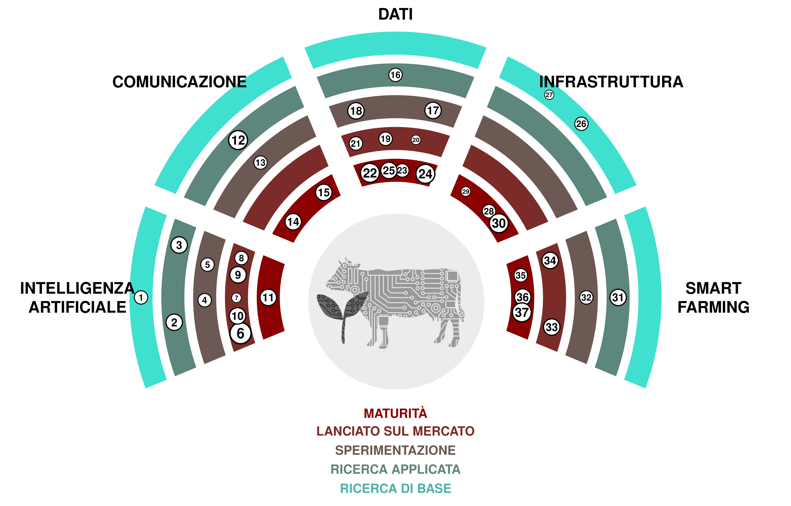

(1) **Superintelligenza:** Un agente o sistema ipotetico che possiede un'intelligenza che supera di gran lunga quella degli esseri umani più brillanti e dotati in praticamente tutti i campi di interesse. 

(2) ***AGI*:** Diminutivo per intelligenza artificiale generale. Un tipo ipotetico di agente intelligente che può imparare a svolgere qualsiasi compito intellettuale che gli esseri umani possono eseguire. 

(3) **Traduzione del discorso in tempo reale:** Strumenti che permettono di tradurre istantaneamente il discorso da una lingua a un'altra.  [SpeechTrans 🡥](https://speechtrans.com/)

(4) ***AutoML*:** L'acronimo di Automated Machine Learning, si riferisce al processo di selezione e ottimizzazione automatica dei modelli di *machine learning*. Allows for cheap model fitting wherever small data sets are available. [R package automl 🡥](https://cran.r-project.org/web/packages/automl/)

(5) **Testo-da-leggere:** Software che genera discorsi da testi scritti che suonano come (interessanti) esseri umani.  [OpenAI’s TTS 🡥](https://platform.openai.com/docs/guides/text-to-speech)

(6) **Modelli Linguistici di Ampia Dimensione:** Sistemi di intelligenza artificiale capaci di generare testi scritti in modo simile all'uomo.  [ChatGPT 🡥](https://chat.openai.com/)

(7) **Riconoscimento Facciale:** Software in grado di misurare la somiglianza dei volti da immagini o video, riconoscendo così i visi.  [PimEyes 🡥](https://pimeyes.com/)

(8) **Modelli di Diffusione Latente:** Modelli che generano immagini arbitrarie da input di testo, immagine o parametri.  [Midjourney 🡥](https://www.midjourney.com/)

(9) **Da voce a testo:** Modelli di apprendimento automatico che convertono il discorso di varie lingue in testo.  [Whisper 🡥](https://openai.com/research/whisper)

(10) **Grandi Modelli Multimodali:** Sistemi avanzati di intelligenza artificiale in grado di elaborare informazioni provenienti da più tipi di dati, come testo, immagini, audio e video, utilizzando potenti modelli di linguaggio pre-addestrati come componente chiave.  [GPT-4 🡥](https://openai.com/blog/chatgpt-can-now-see-hear-and-speak)

(11) **Traduzione Automatica:** Software che traduce automaticamente il testo da una lingua all'altra. Such software can make it much more feasible to publish content to all national languages. [Deepl 🡥](https://deepl.com/)

(12) **Gestione e Monitoraggio dei *Social Media*:** Monitoraggio, analisi e risposta ai contenuti su piattaforme di *social media* per gestire la presenza e la reputazione online di un'organizzazione o individuo. 

(13) **Avatar del *Metaverse*:** Avatar dall'aspetto realistico che permettono una presenza apparentemente naturale nel *Metaverse*. This technology could allow for a more direct connection during remote meetings. [Interview 🡥](https://www.youtube.com/watch?v=MVYrJJNdrEg)

(14) **TikTok:** Piattaforma di social media incentrata sui contenuti video brevi, popolare per la sua vasta gamma di musica, danza, comicità e video creativi generati dagli utenti.  [TikTok 🡥](https://www.tiktok.com/)

(15) **Software Atlassian:** Un insieme di strumenti utili per pianificare, monitorare, organizzare il lavoro, creare documentazioni e collaborare sul *code*.  [Atlassian 🡥](https://www.atlassian.com/software)

(16) **Sequenziamento di prossima generazione:** Tecnologia utilizzata per sequenziare DNA o RNA. Può essere utilizzata in diversi campi di ricerca come lo studio di semi e varietà di piante.  [Illumina 🡥](https://emea.illumina.com/science/technology/next-generation-sequencing.html)

(17) **Green-IT:** Green IT si riferisce al calcolo sostenibile dal punto di vista ambientale, concentrato sulla progettazione, produzione, utilizzo e smaltimento di computer, server e sottosistemi associati in modo efficiente ed efficace con un impatto minimo sull'ambiente. 

(18) **Gemello digitale:** Rappresentazione virtuale di un sistema (ad esempio, una fattoria) basata su sensori e dati in tempo reale per prendere decisioni basate sui dati. 

(19) **Dati aperti collegati:** Linked Open Data è un modo di pubblicare e collegare dati sul web utilizzando standard aperti e *URI* in modo tale che possano essere facilmente accessibili, interrogati e arricchiti da umani e macchine. 

(20) ***ESG*:** Ambientale, Sociale e di Governance Aziendale. Quadro per valutare un'organizzazione riguardo agli standard ambientali, sociali e di governance. 

(21) **Agricoltura verticale:** Produzione di piante in un ambiente controllato e accatastate l'una sull'altra. 

(22) **Dati aperti del governo:** Dati governativi che sono apertamente accessibili al pubblico.  [opendata.swiss 🡥](https://opendata.swiss)

(23) **Resource Description Framework (RDF):** Struttura per rappresentare dati interconnessi sul web (web semantico). È particolarmente destinato a rappresentare metadati su risorse web. 

(24) **i14y:** i14y è la piattaforma svizzera di interoperabilità e funge anche da catalogo nazionale dei dati svizzeri. È gestito dall'Ufficio Federale di Statistica. 

(25) **visualize.admin.ch:** Strumento di visualizzazione per i dati di governo aperto pubblicati su *LINDAS*.  [visualize.admin.ch 🡥](https://www.visualize.admin.ch)

(26) **Archiviazione di dati biomolecolari:** Tecnologia innovativa che utilizza molecole biologiche, principalmente DNA, per memorizzare e recuperare informazioni digitali, offrendo potenzialmente alta densità e lunga conservazione dei dati.  [CNET Article 🡥](https://www.cnet.com/tech/computing/startup-packs-all-16gb-wikipedia-onto-dna-strands-demonstrate-new-storage-tech/)

(27) ***Quantum-Computing*:** Un tipo di calcolo che utilizza fenomeni quantomeccanici, come la *superposition* e l'*entanglement*, per eseguire operazioni sui dati, risolvendo potenzialmente certi problemi più velocemente dei computer classici. 

(28) ***GPU-Clusters*:** Gruppo di computer dotato di unità di elaborazione grafica. Utile per l'allenamento e l'esecuzione di grandi modelli di *machine learning*.  [AWS 🡥](https://aws.amazon.com/nvidia/)

(29) **Virtualizzazione dei Dati:** La virtualizzazione dei dati è una tecnologia che consente il recupero e la manipolazione dei dati senza richiedere dettagli tecnici sui dati stessi, come ad esempio il loro formato o la loro posizione fisica. 

(30) ***Cloud computing*:** Consegna di diversi servizi tramite Internet, inclusi archiviazione dati, server, database, rete e software, fornendo spesso risorse flessibili, innovazione più rapida e economie di scala. 

(31) **Tag digitali per orecchie:** Marche auricolari che permettono di tracciare geograficamente gli animali da fattoria. 

(32) **Fertilizzazione a tasso variabile:** Regolare la quantità e il tipo di fertilizzante applicato alle colture in base alle esigenze specifiche e alle condizioni di diverse aree all'interno di un campo. 

(33) **Robot per la diserbo:** Robot che mirano specificamente alle erbacce in un campo. Le erbacce possono essere distrutte utilizzando erbicidi, zappe, acqua o *lasers*. 

(34) **Immagini da *UAV*:** L'imaging UAV si riferisce al processo di cattura di immagini e video dall'aria utilizzando veicoli aerei senza pilota (*UAV*), comunemente utilizzati per scopi come il rilevamento, la mappatura e la sorveglianza. 

(35) ***IoT*:** L'Internet delle Cose (IoT) si riferisce alla rete di oggetti incorporati con sensori, software e altre tecnologie allo scopo di connettersi e scambiare dati con altri dispositivi e sistemi tramite internet. 

(36) **Robot da mungitura:** Macchina progettata per gestire l'intero processo di mungitura delle mucche da latte, riducendo la necessità di manodopera umana nell'allevamento *dairy farming*. Could automatically send milk data needed for administrative purposes. [Moser Stalleinrichtungen 🡥](http://www.moser-stalleinrichtungen.ch)

(37) **Immagini satellitari:** Coinvolge la cattura di immagini della Terra da satelliti in orbita, che vengono utilizzate per vari scopi. Could be used to determine the vegetation cover period by satellite data.

(38) **Immagini satellitari:** L'imaging satellitare comporta la cattura di immagini della Terra da satelliti in orbita, che vengono utilizzate per vari scopi come la previsione del tempo, la mappatura e il monitoraggio ambientale. Could be used to determine the vegetation cover period by satellite data.