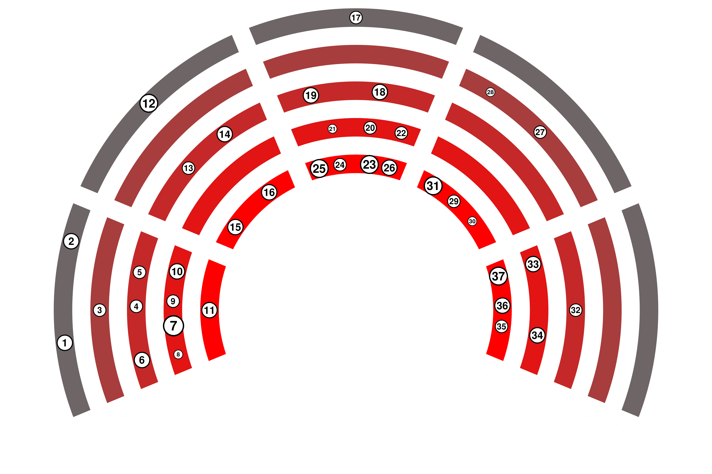

# Warm-up DBDD

This repository contains the R script (`tech-radar.R`) used to create the technology radar pilot as a SVG file. The source data (`data.csv`) contains all relevant information for reproducing the result.

(1) **AGI:** Artificial General Intelligence. A hypothetical type of intelligent agent that can learn to accomplish any intellectual task that human beings or animals can perform.

(2) **Real time speech translation:** Tools using Neural machine translation (NTM) allows to translate instantly speech in one language to another. Example: SpeechTrans

(3) **Superintelligence:** A hypothetical agent or system that possesses intelligence far surpassing that of the brightest and most gifted human minds in virtually all domains of interest.

(4) **AutoML:** Der Hauptvorteil von Auto-ML liegt in der Zeitersparnis bei der Datenverarbeitung und den Testphasen, die notwendig sind, um ein ausreichend leistungsfähiges (AI) Modell in Betrieb zu nehmen.

(5) **text2speech:** Software that generates speech from written text which sounds like (interesting) human beings. <https://openai.com/blog/chatgpt-can-now-see-hear-and-speak>

(6) **Large Multimodal Models:** Large Multimodal Models (LMM) are advanced artificial intelligence systems that can process and generate information from multiple types of data, such as text, images, audio, and video, using powerful pre-trained language models as a core component.

(7) **Large Language Models:** Machine learning models capable of generating written text in a human-like manner. GPT-3.5, GPT-4, Bard, Claude 2, LLAMA.

(8) **Facial Recognition:** Software that can measure the similarity of faces from images or video, thus recognizing faces. <http://clearview.ai> <https://pimeyes.com>

(9) **Latent Diffusion Models:** Neural network models that allows high resolution image synthesis using less resources than other methods (GAN, VAE, ARM). Can generate images from text input, remove objects on images. GitHub - CompVis/latent-diffusion: High-Resolution Image Synthesis with Latent Diffusion Models.

(10) **speech2text:** Machine learning models that convert speech of various languages to text. Speech2Text-App

(11) **Machine Translation:** Software that automatically translates text from one language to another. <https://www.deepl.com>

(12) **Social Media Management and Monitoring:** Analysiere und verstehe deine Wirkung in sozialen Medien.

(13) **Realistic Metaverse Avatars:** Refer to interview Mark Zuckerberg on Lex Fridman.

(14) **Multi-stakeholder platforms:** Agridata (data exchange platform)

(15) **TikTok:** Social media platform based on creating, watching and sharing short videos. TikTok - Make Your Day

(16) **Atlassian Software:** Jira, Confluence, Bitbucket are useful technologies, tools for planning, tracking, work organization, document creation, and/or collaborate on code. Products | Atlassian

(17) **Next generation sequencing:** Technology used to sequence DNA, RNA. Can be used in several fields like the study of seeds and plant varieties, GMO control. Next-Generation Sequencing (NGS) | Explore the technology (illumina.com)

(18) **Green-IT:** Lösungen zu schaffen und aufzubauen, die Auswirkungen menschlicher Aktivitäten auf die Umwelt zu verringern oder andere umweltfreundliche Maßnahmen im IT-Bereich zu ergreifen.

(19) **Digital twin:** Virtual representation of a system (e.g. farm) based on sensors and real-time data to make data-driven decisions

(20) **Linked open data:** Linked Open Data is a way of publishing and connecting data on the web using open standards and URIs such that it can be easily accessed, queried, and enriched by humans and machines. See for switzerland: [lindas.admin.ch](https://lindas.admin.ch/)

(21) **ESG:** Environmental, Social and Corporate Governance. Framework to assess an organization regarding environmenteal, social and governance standards.

(22) **Vertical farming:** Producing plants in a tightly controlled environment. Decisions about ressources are data driven.

(23) **Open government data:** Governmental data that is openly accessible to the public. In Switzerland, available open government data is listed on opendata.swiss.

(24) **Resource Description Framework:** Framework to represent interconnected data on the web (semantic web). Used as standard to describe and visualize metadata. See (https://www.w3.org/RDF/)[https://www.w3.org/RDF/]

(25) **i14y:** [Interoperability platform](https://www.i14y.admin.ch/en/home). Switzerland’s national data catalogue. 

(26) **visualize.admin.ch:** Visualization tool of OGD data on LINDAS: [visualize.admin.ch](visualize.admin.ch)

(27) **Biomolecular data storage:** Store Data in DNA is a promising way. DNA can store a density of 10¹⁹ bits of data per cm3 which is way higher than the actual storage methods. The data will be stored according to the binary code where for instance 00 -> A, 01 -> C, 10 -> G and T -> 11. DNA will be sequenced through NGS (Illumina). BioTech | Free Full-Text | DNA Data Storage (mdpi.com) Example: coded 16GB of Wikipedia in DNA. Startup packs all 16GB of Wikipedia onto DNA strands to demonstrate new storage tech - CNET

(28) **Quantum-Computing:** 

(29) **GPU-Clusters:** Computer cluster where each node (at least some) will be equipped with Graphics Processing Unit. Useful for AI analysis. Examples: AWS and NVIDIA (amazon.com), Google Cloud.

(30) **Data Virtualization:** 

(31) **Cloud computing:** 

(32) **Variable rate fertilization:** Gleich aber für Düngung

(33) **Weeding robots:** Intelligentes Sprühen für lokale Behandlungen Ihrer Reihenkulturen, Gräser und Rasenflächen

(34) **UAV imaging:** Luftbildaufnahmen durch Drohnen. Können dazu verwendet werden, Wasserstress zu erkennen oder Nährstoffkarten zu erstellen.

(35) **IoT:** Network of devices that collect data.

(36) **Milking robots:** 

(37) **Satellite imaging:** Use cases such as determining the vegetation cover period by satellite data.
